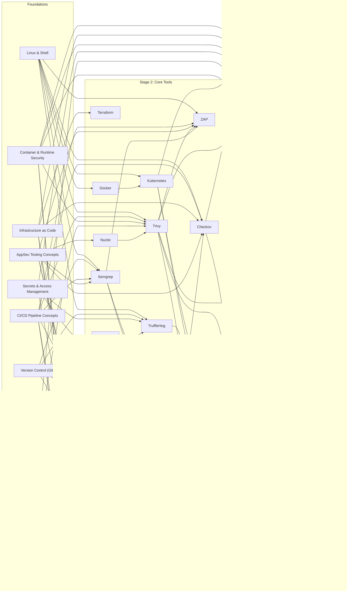

# Learning Path — DevSecOps

> A suggested progression from beginner to confident practitioner. Each stage builds on the previous one. If a topic is listed but has no content yet, it's marked as ⏳ (coming soon).

## Stage 1: Foundations

These concepts have no prerequisites and are the starting point for any security engineer.

- **Linux & Shell Fundamentals** — Everything runs on Linux. Scripts, containers, pipelines all depend on shell fluency. [Linux toolkit guide](../docs/how-to/linux_toolkit.md) | [Cheatsheet](../snippets/linux-cheatsheet.md) | [Practice exercises](../docs/concepts/linux-shell-fundamentals/scripts/2026-07-23-practice-exercises.sh) | [Linux VM terminal first commands](../linux/notes/2026-07-21-install-linux-vm-terminal-first-commands.md) | [Shell scripting confusions](../linux/notes/2026-08-06-linux-shell-scripting-tutorial-confusions.md) | [Cron job config](../linux/configs/2026-08-06-cron-job-configuration.ini) | [Security scanner wrapper script](../docs/concepts/linux-shell-fundamentals/scripts/ci-cd-pipeline-security-scanner-wrapper.sh)
- **Version Control with Git** — Branching, commits, remotes, and CI/CD triggers. Primers cover mental models and everyday commands. [Git fundamentals](../docs/concepts/git-001-version-control-fundamentals.md) | [Commands reference](../docs/reference/git-commands.md) | [Practice exercises](../docs/concepts/version-control-with-git/scripts/2026-07-24-practice-exercises.sh) | [Git hooks for security checks](../docs/concepts/version-control-with-git/scripts/git-hooks-devsecops-security-checks.sh)
- **CI/CD Pipeline Concepts** — How code moves from commit to deployment; why gates and scans matter. [CI/CD toolkit guide](../docs/how-to/ci_cd_toolkit.md) | [Cheatsheet](../snippets/ci-cd-cheatsheet.md) | [Practice exercises](../docs/concepts/ci-cd-pipeline-concepts/scripts/2026-07-17-practice-ci-cd-exercises.sh)
- **Infrastructure as Code** — Terraform, OpenTofu, and the idea of declarative infrastructure. [OpenTofu primer](../opentofu/notes/0000-primer-opentofu.md) | [Explore OpenTofu](../opentofu/notes/2026-07-20-explore-open-tofu.md) | [Terraform state management](../docs/how-to/terraform-state-management.md) | [Practice exercises](../docs/concepts/infrastructure-as-code/snippets/2026-07-23-practice-exercises.hcl)
- **Application Security Testing Concepts** — SAST, DAST, SCA — what they catch and when to use each. Primers on Semgrep, CodeQL, ZAP, Snyk, and Nuclei cover this. [Applying AppSec in DevSecOps](../docs/concepts/application-security-testing-concepts/2026-07-12-applying-appsec-in-devsecops.md) | [AppSec + secrets integration exercise](../docs/concepts/application-security-testing-concepts/snippets/2026-07-19-appsec-secrets-integration.py) | [SCA and dependency exercises](../docs/concepts/application-security-testing-concepts/snippets/2026-08-26-appsec-sca-dependency-exercises.py) | [AST-based pattern checker](../docs/concepts/application-security-testing-concepts/scripts/2026-08-26-ast-devsecops.py)
- **Container & Runtime Security** — Images, registries, runtime behaviour. Trivy, Syft, Grype, Cosign, and Falco all depend on this. [Docker primer](../docker/notes/0000-primer-docker.md) | [Docker security best practices](../docs/how-to/docker-security-best-practices.md)
- **Secrets & Access Management** — How secrets leak and how to protect them. Vault, TruffleHog, Gitleaks, and GitGuardian depend on this. [Vault primer](../vault/notes/0000-primer-vault.md) | [Practice exercises](../docs/concepts/secrets-access-management/snippets/2026-07-24-practice-exercises.py) | [Secrets detection workflow analysis notebook](../docs/concepts/secrets-access-management/notebooks/secrets-detection-remediation-workflow-analysis.ipynb)
- **Software Supply Chain Security** — Dependency risk, SBOMs, signing. Syft, Grype, Cosign, Dependabot all live here. [Practice exercises](../docs/concepts/software-supply-chain-security/snippets/2026-07-23-practice-exercises.sh)
- **Configuration Management** — Desired state, idempotency, drift, and managing systems as code. The foundation for Ansible. [Primer](../docs/concepts/configuration-management/0000-primer-configuration-management.md) | [DevSecOps patterns](../docs/concepts/configuration-management/2026-07-14-devsecops-patterns.md)
- **Observability & Monitoring** — Metrics, logs, traces, SLOs, and understanding system behaviour. The foundation for Prometheus and Grafana. [Observability primer](../docs/concepts/observability-monitoring/notes/0000-primer-observability.md) | [SLI/SLO/SLA definitions](../00_index/glossary.md)

## Stage 2: Core Tools

These tools are unlocked from the start and cover the most common DevSecOps workflows.

- **Git** — Version control foundation for every DevOps workflow. [Primer](../git/notes/0000-primer-git.md) | [Branching and merging](../git/notes/2026-07-04-git-branching-merge-confusions.md) | [First repo: stage and log](../git/scripts/2026-08-24-first-repo-stage-log.sh) | [Local CI simulation](../git/scripts/2026-07-10-local-ci-simulation.sh) | [Layered vs conditional config](../git/configs/config-strategy-layered-vs-conditional.yaml) | [How Git fits the workflow](../git/docs/how-i-wired-git-into-my-version-control-workflow.md)
- **Docker** — Container runtime for packaging and running applications. [Primer](../docker/notes/0000-primer-docker.md) | [Explore the CLI](../docker/notes/2026-07-12-explore-docker-cli.md) | [Custom image](../docker/dockerfiles/2026-07-12-first-custom-docker-image.Dockerfile) | [Networking and volumes](../docker/scripts/2026-07-18-custom-network-volume-mounts.sh) | [CI/CD end-to-end](../docker/docs/cicd-end-to-end.md) | [Reusable build script](../docker/scripts/reusable-build.sh) | [Multi-service Compose scaffold](../docker/templates/multi-service-setup/README.md) | [Production Compose manifest](../docker/manifests/docker-compose-production.yaml)
- **Kubernetes** — Container orchestration for deploying and scaling workloads. [Primer](../kubernetes/notes/0000-primer-kubernetes.md) | [Explore](../kubernetes/notes/2026-07-15-explore-kubernetes.md) | [First manifest](../kubernetes/manifests/2026-07-15-first-pod-service.yaml) | [Cluster workflow wiring](../kubernetes/docs/cluster-workflow-wiring.md) | [Small Deployment from scratch](../kubernetes/manifests/small-deployment-from-scratch.yaml) | [Namespace strategy: environment vs team](../kubernetes/configs/namespace-strategy-environment-vs-team.yaml)
- **Terraform** — Declarative infrastructure provisioning with HCL and providers. [Primer](../terraform/notes/0000-primer-terraform.md) | [First config](../terraform/configs/2026-07-15-first-config.tf) | [Small reusable module](../terraform/configs/small-module-from-scratch.hcl) | [Deploy script](../terraform/scripts/2026-07-18-deploy.sh) | [Cleanup script](../terraform/scripts/2026-07-18-cleanup.sh) | [Module composition guide](../terraform/docs/terraform-module-composition.md) | [Workspace variable precedence](../terraform/configs/workspace-variable-precedence.hcl) | [Provision a Kubernetes cluster](../docs/how-to/k8s-terraform-ansible-provisioning.md)
- **Trivy** — Universal vulnerability scanner for containers, filesystems, repos, and SBOMs. [Primer](../trivy/notes/0000-primer-trivy.md) | [Install and first container scan](../trivy/notes/2026-09-05-install-trivy-first-container-scan.md) | [Scan modes comparison](../trivy/notebooks/trivy-scan-mode-comparison.ipynb) | [Scanning performance optimization](../trivy/notes/scanning-performance-optimization.md)
- **Nuclei** — Template-based vulnerability scanner for web apps, network services, and cloud APIs. [Primer](../nuclei/notes/0000-primer-nuclei.md) | [First template scan attempt](../nuclei/notes/2026-09-20-first-template-scan-attempt.md)
- **Semgrep** — SAST tool with custom rule writing, multi-language support, and CI/CD integration. [Primer](../semgrep/notes/0000-primer-semgrep.md) | [Rule writing reference](../semgrep/docs/semgrep-rule-writing-reference.md)
- **Checkov** — IaC security scanner for Terraform, Kubernetes, CloudFormation. Supports custom policies and plan scanning. [Primer](../checkov/notes/0000-primer-checkov.md) | [Plan scanning](../checkov/scripts/deep-terraform-plan-scan.sh) | [v3 migration guide](../checkov/docs/checkov-v3-migration-guide.md) | [2.x to 3.x upgrade checklist](../checkov/docs/checkov-v3-upgrade-checklist.md) | [Cross-module scanning limitations](../checkov/notebooks/compare-cross-module-scanning-limitations.ipynb) | [Multi-repo drift detection scaffold](../checkov/templates/multi-repo-drift-auto-pr-remediation/README.md)
- **TruffleHog** — Secret scanner with git, filesystem, and S3 scan modes. Custom regex and entropy-based detection. [Primer](../trufflehog/notes/0000-primer-trufflehog.md) | [Scan modes comparison](../trufflehog/docs/comparing-scan-modes-git-filesystem-s3.md)
- **Gitleaks** — Secret scanner using configurable pattern-matching rules with pre-commit and CI integration. [Primer](../gitleaks/notes/0000-primer-gitleaks.md) | [First secret scan](../gitleaks/notes/2026-09-19-first-secret-scan.md)
- **OWASP ZAP** — DAST tool for web application security testing. Baseline, spider, and active scan modes. [Primer](../zap/notes/0000-primer-zap.md) | [Install and first baseline scan](../zap/notes/2026-09-05-install-zap-first-baseline-scan.md) | [DAST workflow](../zap/scripts/dast-workflow-from-scratch.sh)

## Stage 3: Building Skills

Intermediate tools that add SBOM management, software composition analysis, and deeper vulnerability workflows.

- **Helm** — Package manager for Kubernetes charts and releases. [Primer](../helm/notes/0000-primer-helm.md) | [Explore charts, releases, values, repos](../helm/notes/2026-07-19-explore-helm-charts-releases-values-repos.md) | [Quickstart trip-ups](../helm/notes/2026-09-21-quickstart-tripped-me-up.md)
- **Kustomize** — Kubernetes YAML customization without templating. [Primer](../kustomize/notes/0000-primer-kustomize.md) | [First overlay](../kustomize/notes/2026-07-08-install-kustomize-first-overlay.md) | [Quickstart trip-ups](../kustomize/notes/2026-09-21-kustomize-quickstart-tripped-me-up.md) | [Minimal kustomization with overlay](../kustomize/configs/2026-09-22-minimal-kustomization-with-overlay.yaml)
- **GitHub Actions** — GitHub's built-in CI/CD system. [Primer](../github-actions/notes/0000-primer-github-actions.md) | [Explore](../github-actions/notes/2026-08-04-explore-github-actions.md) | [Quickstart trip-ups](../github-actions/notes/2026-09-21-quickstart-tripped-me-up.md) | [Minimal starter workflow](../github-actions/configs/2026-09-21-minimal-starter-workflow.yaml) | [First workflow](../github-actions/configs/2026-07-14-first-github-actions-workflow.yaml) | [Install the gh CLI](../github-actions/notes/2026-08-26-install-gh-cli-first-command.md) | [Minimal push-triggered workflow](../github-actions/snippets/2026-08-26-first-workflow.yaml) | [Composite action input reuse](../github-actions/snippets/2026-08-26-composite-action-input-reuse.yaml)
- **Syft** — SBOM generation in CycloneDX and SPDX formats. Integrates with Grype for vulnerability correlation. [Primer](../syft/notes/0000-primer-syft.md) | [Output format comparison](../syft/notebooks/output-format-comparison.ipynb) | [Source vs library multiarch](../syft/notebooks/source-vs-library-multiarch.ipynb) | [Multi-language SBOM generation](../syft/scripts/syft-sbom-generation.py) | [SBOM pipeline scaffold](../syft/templates/sbom-pipeline-scaffold/README.md) | [Syft + Trivy K8s scan scaffold](../syft/templates/syft-trivy-k8s-scan-scaffold/README.md)
- **Grype** — Vulnerability scanner for container images and filesystems. Designed to consume Syft SBOMs. [Primer](../grype/notes/0000-primer-grype.md) | [Vulnerability diff](../grype/scripts/vuln-diff-two-images.sh) | [End-to-end pipeline](../grype/scripts/grype-end-to-end-scan-pipeline.sh) | [SBOM-to-SARIF pipeline](../grype/scripts/grype-scan-pipeline-end-to-end.sh)
- **CodeQL** — Semantic code analysis with custom QL queries. Supports multiple languages and CI integration. [Primer](../codeql/notes/0000-primer-codeql.md) | [Install and run a first query](../codeql/notes/2026-08-26-install-codeql-first-query.md) | [First query example](../codeql/snippets/2026-09-24-first-codeql-query.py) | [Datalog gotchas](../codeql/notes/2026-06-14-codeql-datalog-gotchas.md) | [Custom queries in CI](../codeql/docs/wired-custom-queries-into-ci.md) | [Query-writing patterns for JavaScript/TypeScript](../codeql/docs/query-writing-patterns-dataflow-javascript-typescript.md) | [CLI vs Actions scan modes](../codeql/notebooks/compare-cli-vs-actions-scan-modes.ipynb) | [Multi-language scan workflow](../codeql/manifests/codeql-multi-language-scan.yaml) | [Custom query-pack scaffold](../codeql/templates/custom-query-pack-ci-harness/README.md)
- **GitGuardian** — Secrets detection platform with ggshield CLI for pre-commit and CI scanning. [Primer](../gitguardian/notes/0000-primer-gitguardian.md) | [Custom policy engine](../gitguardian/snippets/custom-policy-engine-ggshield.sh)
- **Snyk** — Developer security platform for open-source dependencies and containers. [Primer](../snyk/notes/0000-primer-snyk.md) | [CI pipeline integration](../snyk/configs/snyk-ci-github-actions.yaml) | [Multi-language scan scaffold](../snyk/templates/snyk-multilang-scan-scaffold/README.md) | [Vulnerability prioritization with reachability and Fix PRs](../snyk/docs/vulnerability-prioritization-reachability-fix-prs-license-compliance.md)
- **Dependabot** — GitHub's automated dependency update tool for vulnerability patching. [Primer](../dependabot/notes/0000-primer-dependabot.md) | [Configuration template](../dependabot/configs/dependabot-configuration-template.yaml) | [Auto-merge vs manual review](../dependabot/notebooks/auto-merge-vs-manual-review.ipynb) | [npm config](../dependabot/configs/tried-npm-dependabot.yaml) | [Python config](../dependabot/configs/2026-07-18-python-project-version-update.yaml) | [Enabling alerts](../dependabot/notes/2026-07-10-enabling-dependabot-alerts.md) | [Alerts + security updates](../dependabot/notes/2026-07-21-enabling-dependabot-alerts-security-updates.md) | [Custom registry tutorial](../dependabot/notes/2026-08-08-dependabot-custom-registry-tutorial.md)
- **Terrascan** — IaC static analysis for Terraform and Kubernetes with custom Rego rules. [Primer](../terrascan/notes/0000-primer-terrascan.md) | [First scan](../terrascan/notes/2026-06-13-first-scan.md) | [Custom Rego rules](../terrascan/configs/tried-custom-s3-rule.yaml)
- **OpenTofu** — Open-source Terraform fork with the same HCL workflow. [Primer](../opentofu/notes/0000-primer-opentofu.md) | [Explore](../opentofu/notes/2026-07-20-explore-open-tofu.md) | [Quickstart](../opentofu/notes/2026-09-21-follow-open-tofu-quickstart.md) | [Minimal config with vars](../opentofu/configs/2026-09-21-minimal-opentofu-config-with-vars.hcl)
- **tfsec** — Static analysis tool for scanning Terraform code for security misconfigurations at write time. [Primer](../tfsec/notes/0000-primer-tfsec.md) | [First security check](../tfsec/notes/2026-09-20-first-tfsec-scan.md)
- **Prometheus** — Time-series metrics collection and alerting for cloud-native environments. [Primer](../prometheus/notes/0000-primer-prometheus.md) | [Checking the metrics interface](../prometheus/notes/2026-09-20-checking-the-metrics-interface.md)
- **Grafana** — Dashboard and visualization layer for metrics. [Primer](../grafana/notes/0000-primer-grafana.md) | [First datasource](../grafana/configs/2026-09-19-first-datasource.yaml) | [Dashboard browser check](../grafana/notes/2026-09-19-first-dashboard-browser.md)
- **Ansible** — Configuration management and automation over SSH, built on the Configuration Management fundamentals. [Provision a Kubernetes cluster](../docs/how-to/k8s-terraform-ansible-provisioning.md) | [Quickstart trip-ups](../ansible/notes/2026-08-25-followed-ansible-quickstart-what-tripped-me-up.md) | [Minimal playbook: package and service](../ansible/snippets/2026-08-25-minimal-ansible-playbook-package-service.yaml) | [Inventory with group and host vars](../ansible/configs/2026-09-15-inventory-groups-host-vars.yaml) | [CVE-2026-33228 path verification](../ansible/notes/2026-08-17-verify-ansible-cve-2026-33228-paths.md) | [Bootstrap a node](../ansible/scripts/bootstrap-target-node.sh) | [Wired Ansible infrastructure workflow](../ansible/docs/wired-ansible-infrastructure-workflow.md) | [Roles vs tasks](../ansible/notes/roles-vs-tasks.md)

## Stage 4: Advanced Tools

Tools that depend on foundational concepts and earlier tools being complete.

- **ArgoCD** — Declarative GitOps continuous delivery for Kubernetes. Requires Kubernetes and Git fluency. [Primer](../argocd/notes/0000-primer-argocd.md) | [Quickstart trip-ups](../argocd/notes/2026-08-12-quickstart-tripups.md) | [First app deployment](../argocd/notes/2026-07-06-install-argocd-first-app.md) | [Helm guestbook application](../argocd/manifests/helm-guestbook-application.yaml) | [Private repo credentials and RBAC](../argocd/configs/2026-08-17-private-repo-credentials-rbac.yaml) | [GitOps workflow wiring](../argocd/docs/gitops-workflow-wiring.md)
- **SonarQube** — Static analysis platform for bugs, code smells, and security issues with Quality Gates. [Primer](../sonarqube/notes/0000-primer-sonarqube.md) | [Explore quality gates and profiles](../sonarqube/notes/2026-07-19-explore-sonarqube-quality-gates-profiles.md) | [Quickstart](../sonarqube/notes/2026-09-21-follow-sonarqube-quickstart.md) | [Minimal quality gate](../sonarqube/configs/2026-09-21-minimal-quality-gate.yaml)
- **Cosign** — Container image signing and verification as part of the Sigstore project. Requires SBOM and vulnerability awareness. [Primer](../cosign/notes/0000-primer-cosign.md) | [Sign first image](../cosign/notes/2026-06-13-install-cosign-sign-first-image.md) | [Verification patterns](../cosign/docs/cosign-verification-patterns.md) | [Signing pipeline integration](../cosign/docs/container-signing-pipeline.md) | [Key rotation and migration](../cosign/docs/key-rotation-and-migration-patterns.md) | [Key-based vs keyless](../cosign/notebooks/key-based-vs-keyless-signing.ipynb) | [Custom signing image](../cosign/dockerfiles/custom-cosign-image.Dockerfile)
- **Falco** — Runtime security monitoring for containers and Kubernetes. Requires understanding of container behaviour and system calls. [Primer](../falco/notes/0000-primer-falco.md) | [Custom rules](../falco/configs/first-custom-rule-detect-shell-in-container.yaml) | [Explore CLI, rules, events, output](../falco/notes/2026-07-19-explore-falco-cli-rules-events-output.md) | [Rule optimization with priority-based filtering](../falco/docs/rule-optimization-priority-filtering.md)
- **OPA / Gatekeeper** — Policy engine for Kubernetes admission control and IaC validation. Requires understanding of Rego and Kubernetes policies. [Primer](../opa/notes/0000-primer-opa.md) | [Gatekeeper constraint](../opa/configs/tried-a-gatekeeper-constraint.yaml) | [Constraint template design patterns](../opa/docs/constraint-template-design-patterns.md) | [Policy library scaffold](../opa/templates/gatekeeper-policy-library-scaffold/README.md) | [Export audit results](../opa/scripts/export-audit-results.sh)
- **HashiCorp Vault** — Secrets management, dynamic secrets, encryption-as-a-service. [Primer](../vault/notes/0000-primer-vault.md) | [Install and first command](../vault/notes/2026-08-26-install-vault-first-command.md) | [PKI workflow](../vault/scripts/vault-pki-workflow.sh) | [Secrets engine selection guide](../vault/docs/vault-secrets-engine-selection-guide.md) | [KV CRUD](../vault/scripts/vault-kv-crud.sh) | [Policy-as-code](../vault/configs/2026-06-26-dev-test-policies.hcl) | [AWS secrets engine policy](../vault/configs/2026-09-04-aws-secrets-engine-policy.hcl) | [Agent auto-auth on Kubernetes](../vault/docs/vault-agent-auto-auth-kubernetes.md) | [Static vs dynamic secrets](../vault/notebooks/static-vs-dynamic-secrets.ipynb) | [Agent sidecar for secret refresh](../vault/manifests/vault-sidecar-secrets-refresh.yaml)
- **Tetragon** — eBPF-based runtime security observability for detecting kernel-level anomalies in containers. [Primer](../tetragon/notes/0000-primer-tetragon.md) | [Docker install](../tetragon/notes/2026-06-23-install-tetragon-docker-first-events.md) | [Observability tutorial](../tetragon/notes/2026-08-06-tetragon-observability-tutorial.md) | [Network tracing policy](../tetragon/configs/2026-08-05-minimal-network-tracing-policy.yaml) | [Event collection pipeline](../tetragon/scripts/2026-08-05-tetragon-event-collection-pipeline.sh) | [Build a policy from scratch](../tetragon/scripts/build-tetragon-policy.sh)
- **DefectDojo** — Vulnerability management platform for aggregating and tracking security findings. [Primer](../defectdojo/notes/0000-primer-defectdojo.md) | [Quickstart trip-ups](../defectdojo/notes/2026-09-21-quickstart-tripups.md) | [Readiness check script](../defectdojo/scripts/2026-09-20-defectdojo-tutorial-check.sh) | [Install and import report](../defectdojo/snippets/install-defectdojo-first-scan-report.sh)

## Stage 5: Mastery

Cross-cutting integration and custom tooling.

- **Custom policy authoring** — Writing Checkov policies, Semgrep rules, Falco rules, OPA Rego policies, and TruffleHog custom detectors. [Gatekeeper policy library scaffold](../opa/templates/gatekeeper-policy-library-scaffold/README.md) | [Local policy test suite](../opa/templates/gatekeeper-policy-library-scaffold/tests/test-policies.sh)
- **Multi-stage CI/CD pipelines** — Combining SAST + SCA + DAST + secret scanning + SBOM generation + container signing in a single gated pipeline. [TruffleHog PR secret scan reusable workflow](../trufflehog/manifests/trufflehog-pr-secret-scan-reusable.yaml)
- **CVE remediation workflows** — Using the CVE-specific scripts and guides for Ansible, Docker, Jenkins, Kafka, Kubernetes, and Trivy.
- **Multi-cluster security posture management** — Integrating Falco, OPA, Trivy Operator, and kubescape across multiple Kubernetes clusters.
- **Observability stack integration** — Wiring Prometheus metrics, Grafana dashboards, Loki logs, and Jaeger traces into a unified SLO-driven alerting pipeline.
- **Hands-on practice environments** — Rebuilding small setups from saved configs without touching shared infrastructure. [Lab primer](../lab/notes/0000-primer-lab.md) | [Setting up the lab directory](../lab/notes/2026-09-20-setting-up-the-lab-directory.md) | [First lab environment](../lab/configs/2026-09-19-first-lab-env.yaml) | [Dev/staging/prod comparison](../environments/notes/2026-09-19-first-environment-comparison.md)

## Progression Map

